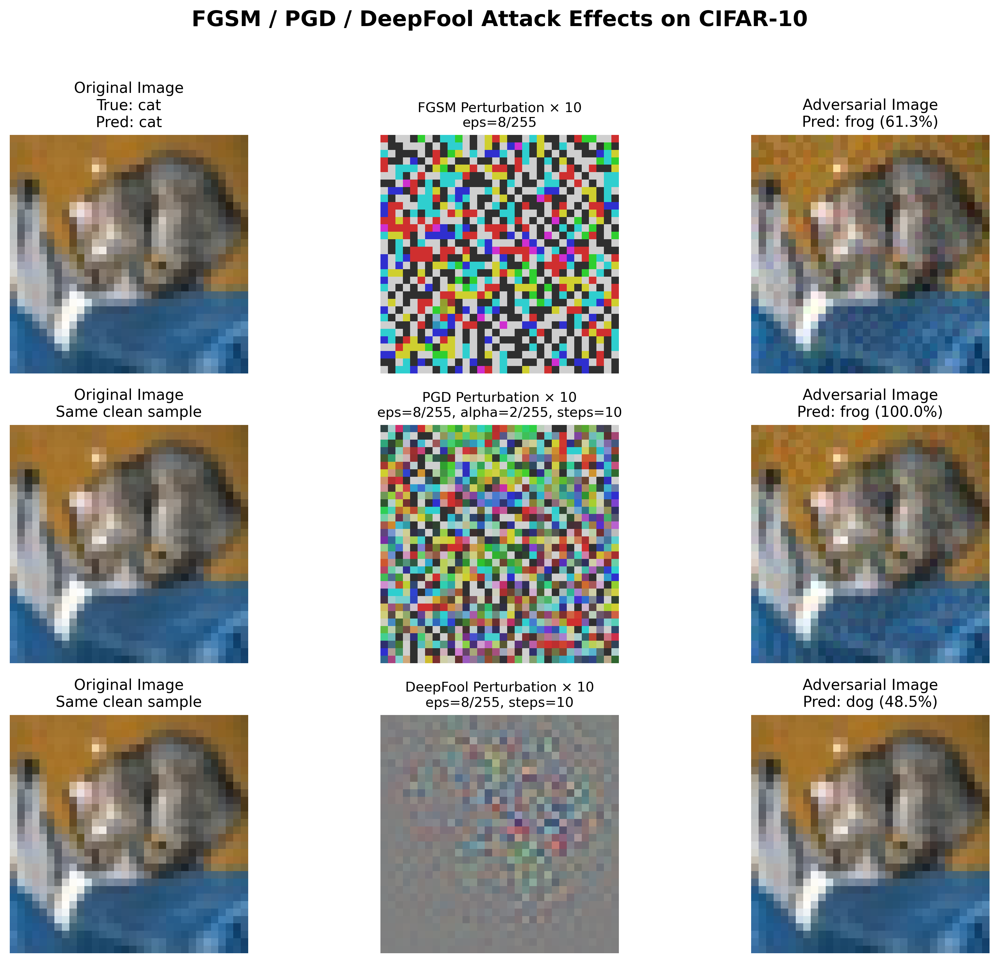
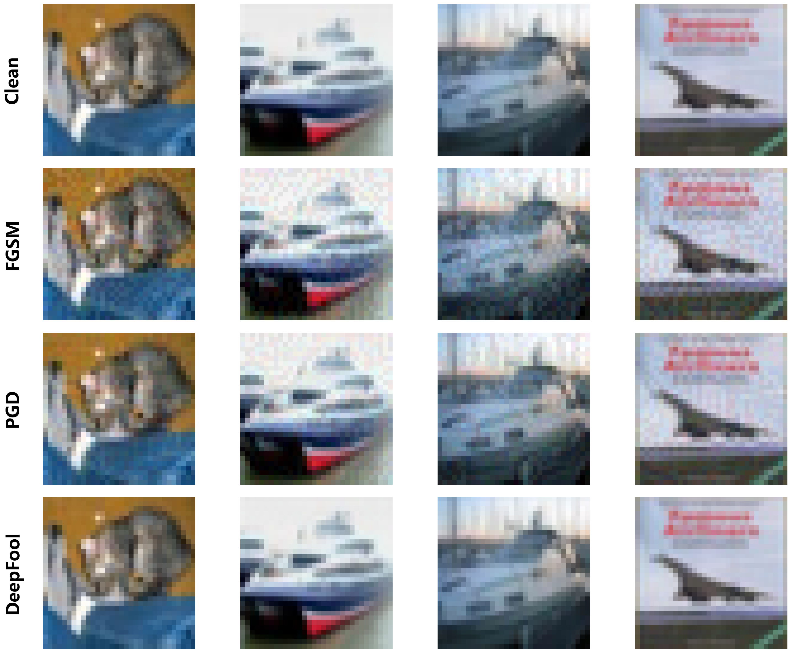
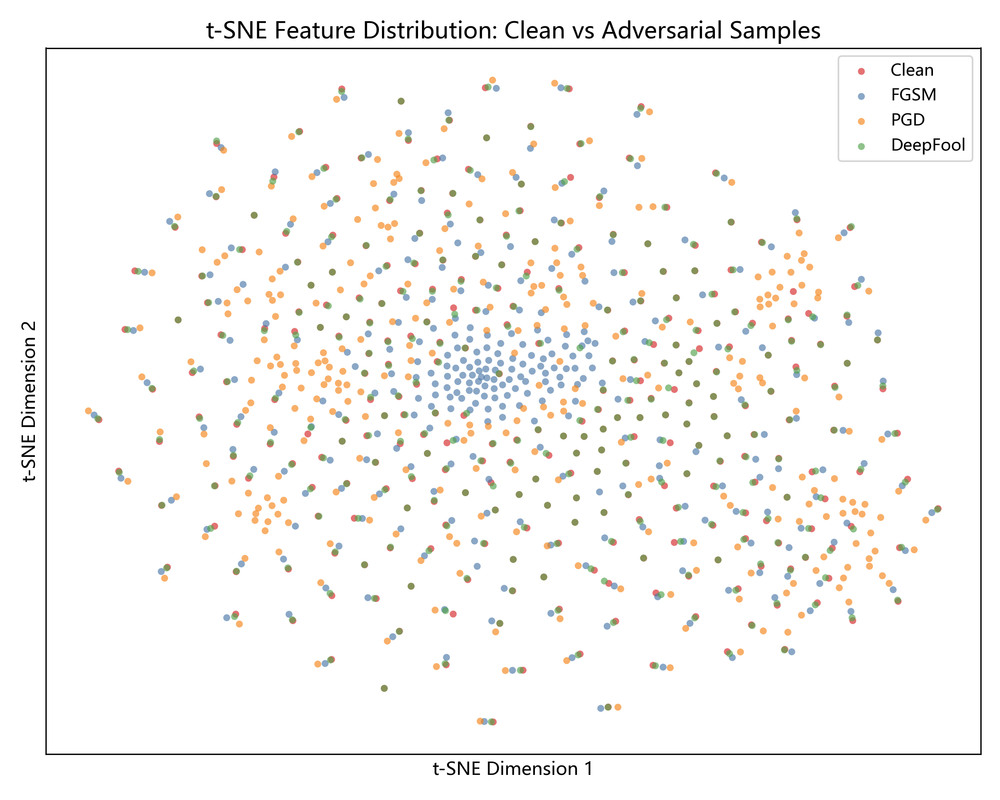
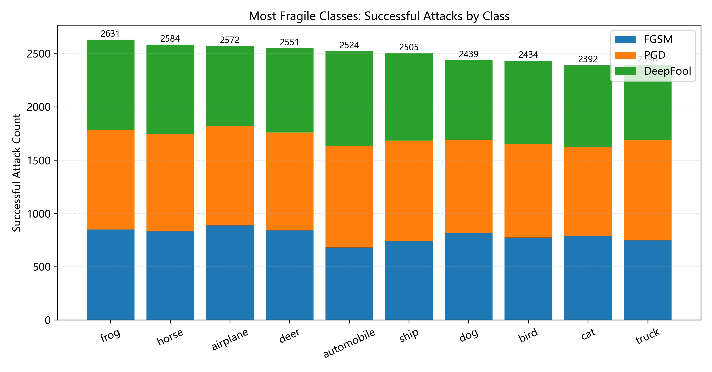
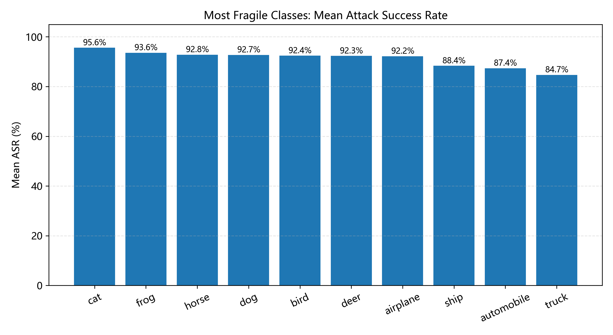

# 🛡️ 基于 CIFAR-10 的对抗样本迁移攻击与鲁棒防御实验

<div align="center">

[](https://github.com/Jscholar-Jin/ai-course-project-adversarial-attacks/stargazers)
[](https://github.com/Jscholar-Jin/ai-course-project-adversarial-attacks/network/members)
[](LICENSE)
[](https://www.python.org/)
[](https://pytorch.org/)
[](https://developer.nvidia.com/cuda-toolkit)

**研究对抗攻击的迁移性、黑盒攻击能力，以及多种防御策略的有效性**
---
---
</div>

# 人员分工

| 成员 | 负责内容 |
|------|----------|
| **金纪勇** | 项目总体设计与统筹；SimpleCNN、ResNet18 模型训练；FGSM、PGD、MI-FGSM、DeepFool、SPSA 攻击算法实现；JPEG 压缩、Feature Squeezing、BPDA 防御实现；FGSM/PGD 对抗训练；实验设计、结果分析、GitHub 项目整理及实验报告撰写。 |
| **周杨** | 数据集整理与预处理；模型训练流程调试；攻击实验与防御实验运行；实验数据统计与结果整理；协助实验验证。 |
| **程湜** | 攻击效果评估模块实现；白盒攻击、迁移攻击、黑盒攻击实验测试；EPS、Steps 敏感性实验；实验结果汇总与图表制作。 |
| **廖苒希** | 对抗样本可视化；t-SNE 特征分布分析；扰动放大与脆弱类别统计；实验图片整理；协助实验结果分析。 |
| **朱子淼** | 项目文档整理；README 编写与维护；PPT 制作；实验报告排版；GitHub 项目维护与成果展示。 |

> **详细成员分工请参见项目根目录下的 `contribution.txt` 文件。**
---

## 📖 项目简介

本项目基于 **CIFAR-10** 数据集，系统性地研究了深度学习图像分类模型在对抗样本攻击下的鲁棒性问题。项目完整实现了：

- ✅ **白盒攻击**（White-box）
- ✅ **迁移攻击**（Transfer-based Black-box）
- ✅ **查询-based 黑盒攻击**（Query-based Black-box）
- ✅ **输入预处理防御**（JPEG / Bit-depth Squeezing）
- ✅ **对抗训练防御**（FGSM / PGD）
- ✅ **BPDA 自适应攻击评估**
- ✅ **可视化与特征分析**（t-SNE、扰动放大、脆弱类别统计）

### 实验设置

| 角色        | 模型      | 说明                 |
| ----------- | --------- | -------------------- |
| **Model A** | ResNet18  | 迁移攻击的源模型     |
| **Model B** | SimpleCNN | 主要被攻击的目标模型 |

---

## ✨ 核心亮点

- 🔬 **全面攻击方法**：FGSM、PGD、MI-FGSM、DeepFool、SPSA
- 🛡️ **多维度防御**：输入预处理 + 对抗训练 + 自适应攻击评估
- 📊 **丰富可视化**：27 张高质量实验图表，涵盖攻击效果、参数敏感性、特征分布等
- 🔄 **迁移性分析**：深入研究对抗样本跨模型迁移能力
- 🧪 **自适应攻击**：使用 BPDA 评估输入预处理防御的真实鲁棒性

---

## 📸 实验结果预览

### 1. 攻击效果总览

<div align="center">
  
  <p><i>白盒、迁移、黑盒攻击效果对比</i></p>
</div>


### 2. 对抗样本可视化

<div align="center">
  
  <p><i>Clean → FGSM → PGD → DeepFool 对抗样本对比</i></p>
</div>


### 3. t-SNE 特征分布分析

<div align="center">
  
  <p><i>干净样本与对抗样本在特征空间中的分布差异</i></p>
</div>


### 4. 脆弱类别分析

<div align="center">
  <table>
    <tr>
      <td align="center">
        <br>
        <i>脆弱类别攻击成功次数</i>
      </td>
      <td align="center">
        <br>
        <i>脆弱类别平均 ASR</i>
      </td>
    </tr>
  </table>
</div>


---

## 📁 项目结构

```text
ai-course-project-adversarial-attacks/
│
├── models.py
│   ├── SimpleCNN 模型定义
│   ├── ResNet18 模型定义
│   └── 模型加载接口
│
├── data_utils.py
│   ├── CIFAR-10 数据集下载
│   ├── 数据预处理
│   ├── DataLoader 构建
│   └── 随机种子设置
│
├── attacks.py
│   ├── FGSM
│   ├── PGD
│   ├── MI-FGSM
│   ├── DeepFool
│   ├── SPSA
│   └── 统一攻击接口
│
├── defenses.py
│   ├── JPEG Compression
│   ├── Feature Squeezing
│   ├── BPDA（Backward Pass Differentiable Approximation）
│   └── 输入预处理模块
│
├── train.py
│   └── Baseline 模型训练（SimpleCNN / ResNet18）
│
├── train_adv.py
│   └── FGSM 对抗训练
│
├── train_adv_final.py
│   └── PGD 对抗训练（最终版）
│
├── eval.py
│   └── 通用评估接口
│
├── eval_attacks.py
│   ├── 白盒攻击评估
│   ├── 迁移攻击评估
│   └── 黑盒攻击评估
│
├── eval_adv.py
│   ├── FGSM 对抗训练模型评估
│   └── PGD 对抗训练模型评估
│
├── eval_bpda_adaptive.py
│   └── BPDA 自适应攻击评估
│
├── eps.py
│   └── EPS 扰动大小敏感性实验
│
├── steps.py
│   └── PGD 迭代次数敏感性实验
│
├── summary.py
│   ├── 实验结果汇总
│   ├── 统计表生成
│   └── 对比图绘制
│
├── tsne.py
│   ├── 特征提取
│   ├── t-SNE 降维
│   └── 特征分布可视化
│
├── visualize_v3.py
│   └── Clean / FGSM / PGD / DeepFool 四行可视化
│
├── visual_adv_diff_and_fragile.py
│   ├── 原图-扰动-对抗样本对比
│   ├── 扰动放大显示
│   ├── 脆弱类别统计
│   └── 脆弱样本分析
│
├── requirements.txt
│   └── Python 依赖库
│
├── README.md
│   └── 项目说明文档
│
├── contribution.txt
│   └── 项目成员分工说明
│
├── checkpoints/
│   ├── cnn.pt
│   ├── resnet.pt
│   ├── cnn_fgsm_adv_train.pt
│   └── cnn_pgd_adv_final.pt
│
├── logs/
│   ├── cnn.csv
│   ├── resnet.csv
│   ├── fgsm_adv_training_log.csv
│   └── pgd_adv_training_log.csv
│
├── results/
│   ├── attack_effect_results.csv
│   ├── eps_sensitivity.csv
│   ├── steps_sensitivity.csv
│   ├── transfer_deepfool_steps_sensitivity.csv
│   ├── adv_training_eval_results.csv
│   ├── bpda_adaptive_results.csv
│   ├── tsne_features.csv
│   ├── fragile_class_stats.csv
│   ├── fragile_samples.csv
│   └── summary.csv
│
└── figures/
    ├── 攻击效果图
    │   ├── all_attack_effects.png
    │   ├── attack_adv_acc_bar.png
    │   └── attack_asr_bar.png
    │
    ├── 参数敏感性分析
    │   ├── eps_sensitivity_adv_acc.png
    │   ├── eps_sensitivity_asr.png
    │   ├── steps_sensitivity_adv_acc.png
    │   ├── steps_sensitivity_asr.png
    │   ├── transfer_deepfool_steps_adv_acc.png
    │   └── transfer_deepfool_steps_asr.png
    │
    ├── 防御实验
    │   ├── adv_training_adv_acc_bar.png
    │   ├── adv_training_asr_bar.png
    │   ├── bpda_adaptive_adv_acc_bar.png
    │   └── bpda_adaptive_asr_bar.png
    │
    ├── 可视化分析
    │   ├── vis_4rows.png
    │   ├── vis_examples.png
    │   ├── adv_diff_examples.png
    │   ├── tsne_clean_vs_attacks.png
    │   ├── tsne_clean_vs_each_attack.png
    │   ├── tsne_attack_success_selected.png
    │   ├── fragile_class_counts.png
    │   └── fragile_class_asr.png
    │
    └── 汇总图
        ├── clean_acc.png
        ├── whitebox.png
        ├── white_eps.png
        ├── pgd_steps.png
        ├── transfer.png
        ├── preprocess.png
        ├── adv_train.png
        └── adaptive.png
```
## 🚀 快速开始

### 环境配置

```bash
# 推荐环境
Python >= 3.10
PyTorch >= 2.7.1 + cu118
CUDA >= 11.8
```

安装依赖：

```bash
pip install -r requirements.txt
```

### 一键训练 Baseline 模型

```bash
python train.py --model both --epochs 30 --batch-size 128 --workers 2 --download
```

### 完整实验流程（推荐顺序）

<details>
<summary><b>点击展开完整实验命令</b></summary>


#### 1. 训练 Baseline

```bash
python train.py --model both --epochs 30 --batch-size 128 --workers 2 --download
```

#### 2. FGSM 对抗训练

```bash
python train_adv.py --model cnn --clean-checkpoint ./checkpoints/cnn.pt \
  --save-path ./checkpoints/cnn_fgsm_adv_train.pt \
  --log-path ./logs/fgsm_adv_training_log.csv \
  --epochs 10 --batch-size 128 --eps 0.0313725 --clean-weight 0.5 --adv-weight 0.5
```

#### 3. PGD 对抗训练

```bash
python train_adv_final.py --model cnn --init-checkpoint ./checkpoints/cnn.pt \
  --save-path ./checkpoints/cnn_pgd_adv_final.pt \
  --log-path ./logs/pgd_adv_training_log.csv \
  --epochs 20 --batch-size 128 --eps 0.0313725 --alpha 0.0078431 \
  --train-pgd-steps 7 --eval-pgd-steps 10 --clean-weight 0.5 --adv-weight 0.5
```

#### 4. 评估攻击效果

```bash
python eval_attacks.py --batch-size 128 --model-a resnet --checkpoint-a ./checkpoints/resnet.pt \
  --model-b cnn --checkpoint-b ./checkpoints/cnn.pt --eps 0.0313725 --steps 10
```

#### 5. 生成所有可视化

```bash
python summary.py
python visualize_v3.py --model cnn --checkpoint ./checkpoints/cnn.pt
python tsne.py --model cnn --checkpoint ./checkpoints/cnn.pt --attacks fgsm,pgd,deepfool
python visual_adv_diff_and_fragile.py --model cnn --checkpoint ./checkpoints/cnn.pt
```

</details>

---

## 📊 实验结论

<div align="center">


| 结论                     | 详细说明                                          |
| ------------------------ | ------------------------------------------------- |
| 🥇 **PGD 最强白盒攻击**   | 普通模型在强白盒 PGD 下几乎被完全攻破             |
| 🥈 **MI-FGSM 迁移性最佳** | 动量机制显著增强跨模型迁移能力                    |
| ⚠️ **输入预处理防御有限** | JPEG / Bit-depth 在 BPDA 自适应攻击下效果大幅下降 |
| 🔄 **PGD 对抗训练最优**   | 在白盒、迁移、黑盒场景下综合鲁棒性最强            |
| 🧠 **特征空间剧变**       | 微小像素扰动可显著改变模型特征分布（t-SNE 验证）  |

</div>

---

## 📜 License

本项目采用 [MIT License](LICENSE) 开源协议。

---

## 📖 Citation

如果本项目对你的研究有帮助，欢迎引用：

```bibtex
@misc{ai-adversarial-cifar10-2026,
  author       = {Jscholar-Jin},
  title        = {Adversarial Attacks and Robust Defenses on CIFAR-10},
  year         = {2026},
  publisher    = {GitHub},
  howpublished = {\url{https://github.com/Jscholar-Jin/ai-course-project-adversarial-attacks}},
}
```

---

## 🙏 Acknowledgements

- [CIFAR-10 Dataset](https://www.cs.toronto.edu/~kriz/cifar.html)
- [PyTorch](https://pytorch.org/)
- 课程老师与助教的指导

---

<div align="center">


**⭐ 如果这个项目对你有帮助，请点个 Star 支持一下！**

Made with ❤️ by [Jscholar-Jin](https://github.com/Jscholar-Jin)

</div>
